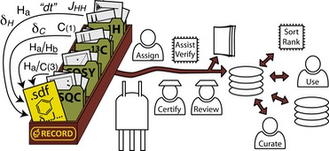
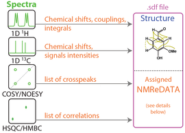

# NMReDATA initiative
*generate, store and share the data extracted from set of NMR spectra associated to a compound
Home [Who are we](partners) [The Format](format) [In the news ...](timeline)

## / Scope

The goal of the NMReDATA initiative is to improve the [FAIRness](https://www.go-fair.org/) and quality of the NMR data available to the community. We introduced a format for the data (see below), but more importantly, a manner to organize the data in such a way that the assignment data can be stored in a reliable manner (using DOI) on freely accessible database and allow for their verification against the experimental spectra.

## / NMReDATA

The NMReDATA include the chemical shifts, scalar couplings, multiplet analysis, list of 2D cross peaks, extracted from a set of NMR spectra and making the link to the assigned chemical structure. We have, in particular, in mind the data resulting from “full analysis”: the results of the analysis of organic compounds and natural products using set 1D 1H, 13C, etc. and 2D COSY, HSQC,  HMBC, etc. spectra.

## / NMR Record

An <strong>NMR record </strong>is a database entry or folders including a [em>.sdf</em> file](Sdf_files) (containing the chemical structure and the NMReDATA) and the folders including the relevant NMR spectra (with FID, acquisition and processing parameters in the manufacturer’s format). In order to facilitate transfers and exchanges of records, the folder can be compressed in the<em> .zip</em> format.

The <strong style="color: rgb(121, 121, 121);">NMR records</strong> (and the included [<em>.sdf</em> file](Sdf_files)) will be generated by computer-assisted structure elucidation software or web-based tools (see [partners of the initiative](partners) and the [list of compatible software](Compatible_software)).

## / .sdf files

We use the existing [“Structure Data Format” (suffix: .sdf)](Sdf_files), containing a chemical structure (in the .mol format) and SDF tags. The [SDF tags](Sdf_files) allow to associate to the structure diverse kinds of data (such as melting point, mass, etc.). The NMRedata initiative decided to define the [format of a set of tags](NMReDATA_tag_format) (with names having the prefix “NMREDATA_”) to include signals assignment, chemical shifts, couplings, lists of 2D correlations and links to the spectra. [format of these tags](format) is an important part of the work of the initiative. Other data (MS, UV-vis, reaction leading to the compound, natural source of the sample, etc.) can also be included in same .sdf files.

More datails on the [wiki pages of the NMReDATA initiative](format)

## Important benefits of the new format

- <strong>Improved quality of the NMR data</strong> for researchers and the community
- Straightforward <strong>inclusion of NMR data</strong> in reports and	journal articles
- Compatibility with <strong>electronic storage</st rong> in database
- Easier <strong>comparison	of dataset</strong>
- Improved<strong>searchability of NMR data (FAIR principle)

## The problem(s) with the current practice

- The text used to describe 1D spectra is difficult to read by computers.
- The tables used to list 2D correlations are impossible to read by computers.
- The chemical drawing (images) are very difficult to read by computers. Moreover computers would have serious difficulties to link structures and NMR data and even more to read the numbering/labeling used on the structure.
- Crude spectra stored in database are almost useless without the assignement data and the corresponding chemical structure(s).

## Relevance of the NMReDATA Initiative in a [<strong>FAIR</strong>](https://www.go-fair.org/) world

Reporting NMReDATA in an open format is gaining importance in a world where the <strong>community expect</strong> and the <strong>funding agencies impose</strong> to scientists to make <strong>open data</strong>. In the absence of NMReDATA spectral data are almost useless because the chemical structure they correspond are not linked and because the assignement data are not present or in propriatary format.

![images/pasted-file_med.png]
											
